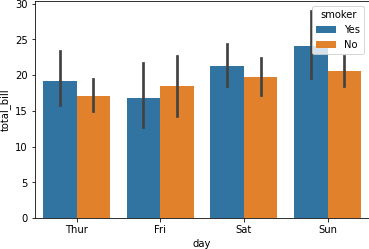
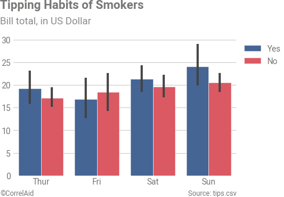

# CorrelAid matplotlib style sheet and helper functions

This repository provides a [matplotlib style sheet](https://matplotlib.org/3.3.3/tutorials/introductory/customizing.html) following the CorrelAid style guide and some plotting helper functions, possibly useful in the CorrelAid context, i.e. talks, blog posts, and such. It was created in the context of a blog entry.

Besides the default style, matplotlib comes with several built-in styles that we can use readily. To see a list of the available styles use: 

```python
import matplotlib.style as style
print(style.available)
```

```python
['seaborn-deep', 'seaborn-muted', 'bmh', 'seaborn-white', 'dark_background','seaborn-notebook', 'seaborn-darkgrid', 'grayscale', 'seaborn-paper', 'seaborn-talk', 'seaborn-bright', 'classic', 'seaborn-colorblind', 'seaborn-ticks', 'ggplot', 'seaborn', '_classic_test', 'fivethirtyeight', 'seaborn-dark-palette', 'seaborn-dark', 'seaborn-whitegrid', 'seaborn-pastel', 'seaborn-poster']
```
For instance, with the 'ggplot' one can use a style that is similar to the default R ggplot style:

```python
style.use('ggplot')
```

Here, we contribute a CorrelAid theme and helper functions. The package can be used in two different ways:
- Option 1: One can use the style file as described below on its own to style plots.
- Option 2: One can install this repository as Python package and use the style and the helper functions.

## Install

### Option 1 Using only on the style file

The stlye file should be placed in your user folder in the .matplotlib folder (should already exist), in a folder `stylelib`  as follows:
```bash
~/.matplotlib/stylelib/correlaid.mplstyle
```
You may verify that it is detected by using the above `style.available` command.

Alternatively, you can simply put the file to your working directory and use the absolute path.

### Option 2 Install using pip

To install the package simply run
```bash
pip install correlaidmatplotlib
```
This installs the package locally using pip and installs matplotlib, if not available, as well as numpy and seaborn that are only used for the example notebooks.

### Option 3 Manually download and locally install the correlaidmatplotlib package

This is similar to option 1, and maybe useful if you want to add changes to the package. Then download or checkout this repository. Then in the top level that contains the `setup.py` file, run
```bash
pip install .
```
This installs the package locally using pip and installs matplotli, if not available, as well as numpy and seaborn that are only used for the example notebooks.

### For all three options
The style uses the [Google Roboto font](https://fonts.google.com/specimen/Roboto). Make sure it is installed in your system. If there is a error message that the font cannot be found (may happen in Jupyer notebook), try deleting the [matplotlib cache directory](https://matplotlib.org/3.1.1/faq/troubleshooting_faq.html#matplotlib-configuration-and-cache-directory-locations).

## Use

### Option 1 Using only the style file
The the style file can then be used as follows:
```python
style.use('correlaid')
```

If not added to the user directory, it can also be placed in the working directory and linked:
```python
style.use('./correlaid.mplstyle')
```

Then the following default color cycler is used for plotting:
```python
import seaborn as sns
import matplotlib.pyplot as plt
sns.palplot(plt.rcParams['axes.prop_cycle'].by_key()['color'])
```


So for instance, a Seaborn plot in the default style looks as follows
```python
import seaborn as sns
tips = sns.load_dataset("tips")
ax = sns.boxplot(x="day", y="total_bill", hue="smoker", data=tips)
```


It can be changed to the CorrelAid style to look as follows:
```python
import matplotlib.style as style
style.use("correlaid")
ax = sns.boxplot(x="day", y="total_bill", hue="smoker", data=tips)
```


### Options 2 and 3 Useing the package and the helper functions

When using the Python package, then one can simply import the package to apply the style, without using `style.use('correlaid')`.

```python
import correlaidmatplotlib
```
*Note:*: the import should be after importing `matplotlib` and `seaborn`. Otherwise and explicit `style.use('correlaid')` (see Option 1), should be inserted after all the imports and other style uses, to make sure the font sizes are correct.

While the default Seaborn plots are quite powerful and the style already improves some defaults, there is still room for improvement. With the CorrelAid package we provide helper functions to further style the plots consistently, i.e., we:
- add Title and subtitle,
- add a signature bar adding a Copyright and data source,
- take away the x and y axis labels, that are not necessary, when using the subtitle,
- move the legend to the right of the figure

```python
fig, ax = plt.subplots()
sns.barplot(x="day", y="total_bill", hue="smoker", data=tips, ax=ax)
set_correlaid_style(fig, "Tipping Habits of Smokers", "Bill total, in US Dollar", source="tips.csv",
                   title_x_pos=0.03, subtitle_x_pos=0.03, copyright_x_pos=0.03,
                   title_y_pos=0.1, subtitle_y_pos=0.0, signature_fontsize="smaller")
```


For more control over the individual parts, see the notebook `Option2 Install Package.ipynb`.

## Contribute
The style file is not yet complete and will only work for a subset of all the possible matplotlib and Seaborn plots. There may still be lines and parts of the plot that may not have been correctly styled yet. Feel free to add more parameters to the file via a pull request or raise an issue for plot types that appear not yet as expected. Of course any feedback on styles, or ideas for improvements are welcome.

## More Information
The style is mostly based on this blog post:
- https://www.dataquest.io/blog/making-538-plots/
